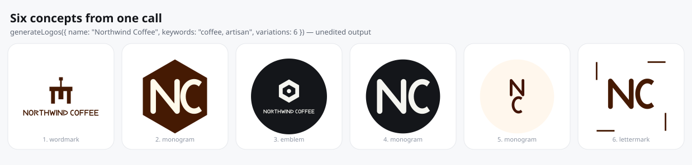
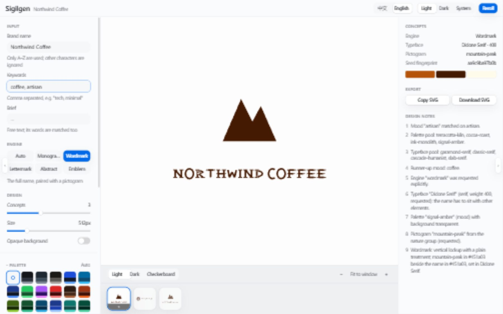
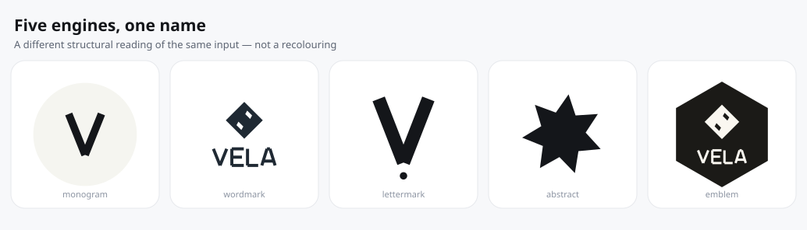

# Sigilgen

[](https://github.com/xianshi3/sigilgen/actions/workflows/ci.yml)
[](LICENSE)
[](https://nodejs.org)
[](package.json)
[](tsconfig.json)

Deterministic, flat geometric SVG logos from a brand name and a few keywords.

Sigilgen is not an image model. It is a curated knowledge base plus a deterministic renderer: give it
`Acme` and `tech, minimal` and you get the same flat geometric SVG every time, on every platform, plus a
short note explaining each choice. No network, no API key, no runtime dependencies.



<sub>Unedited output of
`generateLogos({ name: 'Northwind Coffee', keywords: 'coffee, artisan', variations: 6 })`, drawn by
`scripts/build-docs-images.mjs`.</sub>

```ts
import { generateLogo } from 'sigilgen'

const logo = generateLogo({ name: 'Acme', keywords: 'tech, minimal' })

logo.svg // '<svg xmlns="http://www.w3.org/2000/svg" viewBox="0 0 512 512" ...>'
logo.engine // 'monogram' | 'wordmark' | 'lettermark' | 'abstract' | 'emblem'
logo.palette.id // 'graphite-signal'
logo.font.family // 'Orbit Grotesk'
logo.conceptNotes // why this palette, this typeface, this engine
```

### Why this exists

Most logo generators are a diffusion model behind an API: you get one image, you cannot ask for it
again, and you cannot ask why. Sigilgen takes the opposite position. Every decision — the mood, the
engine, the palette, the typeface, the container — comes from a curated table the project ships, and
every one of them is reported back to you in words. That buys three things an image model cannot offer:

- **Reproducibility.** The same input gives the same bytes on any machine, any Node version, any
  working directory. CI asserts it against a recorded hash across Linux, macOS, Windows and two Node
  versions.
- **Explainability.** A mark you dislike can be _diagnosed_ rather than rerolled: the notes name the
  pool it drew from and the reason it chose.
- **Editability.** Because the type is compiled from geometric skeletons rather than licensed, a
  palette, a typeface or a whole new letter can be changed as data.

## Contents

- [Features](#features)
- [Installation](#installation)
- [Studio](#studio-browser-app)
- [CLI](#cli)
- [API](#api)
- [How a logo is decided](#how-a-logo-is-decided)
- [Guarantees](#guarantees)
- [The curated brain](#the-curated-brain)
- [Documentation](#documentation)
- [Contributing](#contributing)
- [Security](#security)
- [License](#license)

## Features

- **Deterministic.** The same input always produces byte-identical output. Not "visually similar" —
  the same bytes.
- **Zero AI dependency.** Every decision comes from a curated JSON knowledge base: 33 palettes, 18
  typeface families with 468 pre-generated glyph outlines, 70 pictograms and 34 mood rules.
- **Zero runtime dependencies.** SVG output needs nothing installed. PNG output is optional.
- **Explainable.** Every concept carries notes naming the mood that matched, the pool it drew from, and
  the structural reason for the engine it chose.
- **Five engines.** `monogram`, `wordmark`, `lettermark`, `abstract` and `emblem` — each a different
  structural reading of the same input, not a recolouring.
- **Flat SVG only.** No gradients, filters, masks, clips, patterns, images, text or scripts. A `viewBox`
  is always present, so output scales cleanly.
- **One to six concepts per call.** Variations differ in engine, palette, typeface and composition.
- **Unicode-safe.** Type, geometry and colour names are all Unicode-aware.

## Installation

Not yet on npm. Install straight from the repository — the `prepare` script builds it for you:

```bash
pnpm add github:xianshi3/sigilgen
# or
npm install github:xianshi3/sigilgen
```

Or clone and use the CLI in place:

```bash
git clone https://github.com/xianshi3/sigilgen.git
cd sigilgen
pnpm install
pnpm build
node dist/cli.js --name "Acme" --keywords "tech, minimal"
```

Node.js 22.12 or newer. The package has no runtime dependencies; `sharp` is optional and only needed
for PNG output.

Once installed, the CLI is on your path:

```bash
npx sigilgen --name "Acme" --keywords "tech, minimal"
```

## Studio (browser app)

`apps/web` is a bilingual browser interface for the same generator: type a name, pick a concept, hold
the decisions you like still while the rest vary, and copy or download the SVG.



<sub>Captured from the running app. The other two images on this page are generated from the
generator itself by `pnpm run docs:images`; this one cannot be, because it is a picture of a UI.</sub>

```bash
cd apps/web
pnpm install
pnpm dev        # http://localhost:5173
```

It imports the generator's source directly, so editing an engine in `src/` hot-reloads the app. See
[apps/web/README.md](apps/web/README.md).

## Five engines



<sub>One name through each engine. Unedited output, drawn by
`scripts/build-docs-images.mjs`.</sub>

## CLI

```bash
sigilgen --name "Acme" --keywords "tech, minimal"
sigilgen --name "Ledgerly" --keywords fintech -N 4 --output ./out/
sigilgen --name "Ember" --keywords coffee --palette "#2B1B12,cream,rust"
sigilgen --name "Relay" --keywords "mesh networking" --json
sigilgen --name "Acme" --keywords owl --png --png-size 1024
```

### Options

| Flag                       | Meaning                                                                      |
| -------------------------- | ---------------------------------------------------------------------------- |
| `-n`, `--name <brand>`     | **Required.** Brand name. Letters `A`–`Z` are used; others are ignored.      |
| `-k`, `--keywords <list>`  | Comma or space separated keywords, e.g. `"tech, minimal"`.                   |
| `-b`, `--brief <text>`     | Free-text brief. Keywords are extracted from it too.                         |
| `-e`, `--engine <id>`      | Force an engine: `monogram`, `wordmark`, `lettermark`, `abstract`, `emblem`. |
| `-c`, `--palette <spec>`   | A palette id, or a colour list. Colours may be hex or a name from the brain. |
| `--font <id>`              | Force a typeface id.                                                         |
| `--icon <key>`             | Force a pictogram key.                                                       |
| `-s`, `--seed <number>`    | Numeric seed mixed into the hash. Default `0`.                               |
| `--size <number>`          | Square canvas size, 16–4096. Default `512`.                                  |
| `-N`, `--variations <1-6>` | Number of concepts. Default `3`.                                             |
| `--background`             | Emit an opaque background rectangle.                                         |
| `-o`, `--output <path>`    | Write files instead of stdout. Directories are created.                      |
| `--json`                   | Print a machine-readable summary instead of SVG.                             |
| `--png`                    | Also write a PNG. Requires the optional `sharp` dependency.                  |
| `--png-size <number>`      | PNG edge length in pixels. Default `1024`.                                   |
| `-q`, `--quiet`            | Suppress the summary line on stderr.                                         |
| `-h`, `--help`             | Show help.                                                                   |
| `-v`, `--version`          | Show the version.                                                            |

### Exit codes

| Code | Meaning                                        |
| ---- | ---------------------------------------------- |
| `0`  | Success                                        |
| `1`  | Output could not be written                    |
| `2`  | Invalid arguments or configuration             |
| `3`  | `--png` requested but `sharp` is not installed |

### JSON summary

```bash
sigilgen --name "Ledgerly" --keywords fintech -N 2 --json
```

```jsonc
{
  "name": "Ledgerly",
  "seed": 0,
  "size": 512,
  "count": 2,
  "logos": [
    {
      "engine": "lettermark",
      "seed": "a3f19c02d4e1",
      "palette": {
        "id": "blue-chip",
        "primary": "#1e40af",
        "secondary": "#1e3a8a",
        "accent": "#eff6ff",
        "highlight": "#60a5fa",
        "background": null,
      },
      "font": { "id": "baseline-humanist", "family": "Baseline Humanist", "weight": 600 },
      "icon": null,
      "conceptNotes": ["Mood \"fintech\" matched on fintech.", "…"],
      "svg": "<svg …>",
    },
  ],
}
```

## API

### `generateLogo(config): LogoResult`

One concept. When `variations` is omitted or greater than one, only the first is returned.

```ts
import { generateLogo } from 'sigilgen'

const logo = generateLogo({
  name: 'Northwind Coffee',
  keywords: 'roastery, artisan, warm',
  brief: 'A small-batch roastery that wants to look established, not trendy',
  variations: 1,
})
```

### `generateLogos(config): LogoResult[]`

Between one and six concepts. Each is independently seeded from the concept index, so concept 2 is the
same whether you asked for two concepts or six.

```ts
import { generateLogos } from 'sigilgen'

for (const concept of generateLogos({ name: 'Vela', keywords: 'marine, travel', variations: 4 })) {
  console.log(concept.engine, concept.palette.id, concept.font.family)
  console.log(concept.conceptNotes.join('\n'))
}
```

### Configuration

```ts
interface LogoConfig {
  name: string // required, max 64 characters, must contain at least one A–Z
  keywords?: string // max 240 characters
  brief?: string // max 600 characters
  engine?: 'monogram' | 'wordmark' | 'abstract' | 'emblem' | 'lettermark'
  palette?: string // palette id, or "#2B1B12,cream,rust"
  font?: string // font id, e.g. "orbit-grotesk"
  icon?: string // icon key, e.g. "mountain-peak"
  seed?: number
  size?: number // 16–4096, default 512
  variations?: number // 1–6, default 3
  background?: boolean
  preferences?: {
    container?: 'circle' | 'squircle' | 'hexagon' | 'shield' | 'seal'
    layout?: string // monogram and wordmark layouts
    treatment?: 'plain' | 'badge' | 'rule'
    accent?: 'none' | 'rule' | 'dot' | 'corner-frame'
    frame?: 'shield' | 'hexagon' | 'circle' | 'banner'
    mode?: 'orbit' | 'venn' | 'arcs' | 'burst' | 'waves'
  }
}
```

**Out-of-range numbers clamp.** `--size 99999` still produces a logo, at 4096. Values that cannot be
repaired are rejected with a message that says what to do: an empty name, a name with no drawable
letters, or an unknown engine.

**`preferences` holds a decision still.** Each engine draws its container, layout, accent and so on from
the seed, which is what makes a reroll produce genuinely different compositions — but it also means a
reader who liked the hexagon in concept two has no way to ask for the hexagon again. Pinning a
dimension keeps it fixed across every concept while everything else keeps varying. A value the engine
does not offer is ignored rather than rejected: a preference is a hint about taste, and a hint must not
be able to fail a render. Omitting `preferences` produces byte-identical output to a version of the
library that had no such field.

### `rasterise(result, options): Promise<RasterResult>`

Optional PNG output. Loads `sharp` dynamically, so SVG users never pay for it.

```ts
import { generateLogo, rasterise, hasRasterSupport } from 'sigilgen'

if (await hasRasterSupport()) {
  const { data, size } = await rasterise(generateLogo({ name: 'Acme' }), { size: 1024 })
  await writeFile('acme.png', data)
}
```

Throws `RasterSupportError` with an actionable message when `sharp` is absent.

### Lower-level modules

Also exported, for building your own pipeline:

| Export                                         | Purpose                                      |
| ---------------------------------------------- | -------------------------------------------- |
| `SeedResolver`                                 | The reproducible numeric stream              |
| `MoodResolver`                                 | Keywords and brief to a design direction     |
| `route`, `engineWeights`, `ENGINES`            | Engine selection                             |
| `resolvePalette`, `resolveFont`, `resolveIcon` | Resource selection                           |
| `serialiseDocument`                            | The serializer, including its safety checks  |
| `BRAIN`, `PALETTES`, `FONTS`, `ICONS`, `MOODS` | The curated data                             |
| `sha256`, `fmt`, `parsePath`, `transformPath`  | Primitives                                   |
| `measureText`, `textPath`                      | Setting and drawing a run from brain metrics |
| `textInk`                                      | The ink a run will actually draw             |
| `fitText`, `naturalWidth`, `opticalTracking`   | Fitting type into a box                      |

#### `textInk(font, letters, scale, tracking?): TextInk`

The ink a run will draw, measured rather than assumed: `{ offsetX, offsetY, width, height }` relative
to the run's origin and cap top. `measureText` answers a different question — how wide the advance boxes
are — and the two differ by the outer side bearings, and in height by however far the tallest letter
falls short of the cap line. Anything that _composes around_ a run needs this rather than
`measureText`; `fitText` returns it as `FittedText.ink`, and the engines centre on it.

## How a logo is decided

The pipeline is a pure function, and every stage says what it did.

1. **Normalise.** The name is validated, letters and words are extracted, numbers are clamped. Word
   splitting distinguishes the name's own words from keywords, so `Ledgerly` with a `fintech` brief
   produces an `L` monogram rather than an accidental `LF`.
2. **Match a mood.** Words are matched against 34 mood rules by prefix. `sustainable outdoor` selects the
   `nature` mood; its pools narrow the choice to a handful of palettes, typefaces and pictograms.
3. **Route to an engine.** Mood weights are adjusted for the shape of the name. Three letters or fewer
   strongly favours a monogram; more than twelve favours a lettermark.
4. **Resolve resources.** Letter marks drop serif and display faces, because a slab serif has no
   personality at 24px. The pictogram is selected or, for the typographic engines, skipped.
5. **Draw.** The engine returns geometry only. No I/O, no randomness beyond the supplied stream.
6. **Serialise.** Markup is produced in exactly one place, and that place allow-lists everything.

### Example concept notes

```text
Mood "fintech" matched on fintech.
Palette pool: ledger-green, blue-chip, ink-monolith, cobalt-forge.
Typeface pool: classic-serif, baseline-humanist, orbit-grotesk, slab-serif.
Engine "lettermark": 8-letter name favours a wordmark; mood "fintech" weights it 2.5.
Typeface "Baseline Humanist" (humanist-sans, weight 600, mood pool): letterforms must survive at icon size.
Palette "blue-chip" (mood) with background transparent.
Pictogram: none, because this engine is typographic by definition.
Lettermark in 2 letters with a rule accent; tracking tightened to -23 units.
```

## Guarantees

**Byte-identical output.** Identical input produces identical bytes. This is enforced by tests that
compare repeated runs, interleaved runs, and runs at different times. It is why the codebase contains
no `Math.random`, no `Date.now`, and no reliance on object iteration order for numeric choices: every
such decision reads from a SHA-256 stream instead.

**Zero runtime dependencies.** There is no `dependencies` section. `sharp` is the single
`optionalDependencies` entry, reached through a dynamic `import()` on the PNG path alone and marked
`external` in the build, so it is never bundled into the artefact. Install it only if you want PNGs.

**Flat output.** No gradient, filter, mask, clip path, pattern, image, text element, script or event
handler. Verified for every engine.

**Untrusted input cannot escape an attribute.** Brand names, keywords, briefs and colour lists are
validated against conservative patterns and rejected rather than escaped and passed through. File names
are slugified so they cannot traverse out of the output directory.

**Type comes from the brain.** Glyph outlines are compiled at build time and shipped as data. No font
file is parsed at runtime, no text is measured through a canvas, and no `measureText` is called.

## The curated brain

All design decisions live in data, under `src/brain/`.

| Data       | Size                    | Purpose                                                   |
| ---------- | ----------------------- | --------------------------------------------------------- |
| Palettes   | 33                      | Colour schemes with matching tags                         |
| Typefaces  | 18 families, 468 glyphs | Generated by `pnpm run build:brain`                       |
| Pictograms | 70                      | Flat icons on a `0 0 24 24` grid                          |
| Mood rules | 34                      | Keywords to palettes, typefaces, icons and engine weights |

Browse it:

```ts
import { MOODS, PALETTES, FONTS, ICONS } from 'sigilgen'

MOODS.find(mood => mood.id === 'fintech')
```

Adding data is the supported way to change the design behaviour — see
[docs/design/002-brain-schema.md](docs/design/002-brain-schema.md).

## Documentation

| Document                                                                                   | Contents                                                               |
| ------------------------------------------------------------------------------------------ | ---------------------------------------------------------------------- |
| [docs/README.md](docs/README.md)                                                           | Documentation index                                                    |
| [docs/design/001-logo-engine-architecture.md](docs/design/001-logo-engine-architecture.md) | The design document: goals, pipeline, engine specification, guarantees |
| [docs/design/002-brain-schema.md](docs/design/002-brain-schema.md)                         | Brain schemas and authoring rules                                      |
| [docs/architecture/decisions/](docs/architecture/decisions/)                               | Architecture decision records                                          |
| [AGENTS.md](AGENTS.md)                                                                     | Conventions and hard constraints for coding agents                     |
| [CONTRIBUTING.md](CONTRIBUTING.md)                                                         | Setup, workflow and review expectations                                |
| [SECURITY.md](SECURITY.md)                                                                 | Supported versions, reporting, scope                                   |

## Contributing

Contributions are welcome. Read [CONTRIBUTING.md](CONTRIBUTING.md) first; it covers the setup commands,
the commit convention, and what reviewers check.

```bash
pnpm install
pnpm run links    # create the AI tool symlinks
pnpm run check    # lint, format check, typecheck, tests
```

## Security

Please do not report vulnerabilities through public issues. See [SECURITY.md](SECURITY.md) for the
private reporting channel, supported versions, response expectations and scope.

## License

[MIT](LICENSE) © Sigilgen contributors
